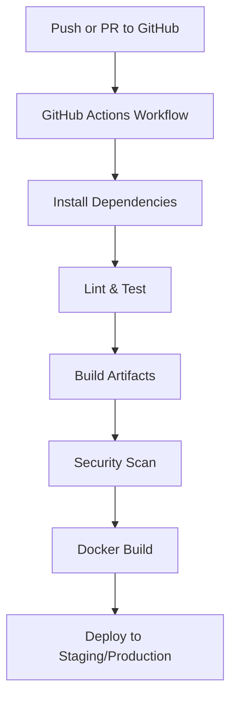

git# CI/CD for Micro-Frontend Webshop

This document describes the Continuous Integration and Continuous Deployment (CI/CD) setup for the micro-frontend webshop application. The architecture leverages GitHub Actions, Docker, and Docker Compose to automate building, testing, security scanning, and deployment of all microfrontends and backend services.

---

## Overview

- **CI/CD Platform:** GitHub Actions
- **Containerization:** Docker, Docker Compose
- **Microfrontends:** Vue.js 3 (shell, product-listing, product-details, shopping-cart, checkout)
- **Backend:** Node.js/Express with SQLite
- **Deployment:** Docker images, optional Nginx reverse proxy, cloud/server ready

---

## CI/CD Workflow Architecture



---

## 1. GitHub Actions Workflow

The workflow is defined in `.github/workflows/ci-cd.yml` and includes the following jobs:

- **Lint and Test:**
  - Runs `npm ci`, `npm run lint`, and `npm test` for each microfrontend and backend.
- **Build:**
  - Builds all microfrontends and backend.
  - Uploads build artifacts for inspection.
- **Backend:**
  - Installs dependencies, runs backend tests, and builds backend if needed.
- **Integration Tests:**
  - Runs integration tests with a mock SQLite database.
- **Security Scan:**
  - Runs `npm audit` for all services.
- **Docker Build:**
  - Builds and (optionally) pushes Docker images to a registry.
- **Deploy:**
  - Deploys to staging or production based on branch.
- **Performance Test:**
  - Runs Lighthouse and load tests (optional, for staging).

---

## 2. Dockerization

Each service (backend and microfrontends) has its own `Dockerfile`:

- **Backend:**
  - Node.js 18 Alpine base image
  - Installs dependencies, copies code, runs as non-root user
  - Health check via `/api/health` endpoint
- **Microfrontends:**
  - Multi-stage build: Node.js for build, Nginx for serving static files
  - Custom `nginx.conf` for SPA routing, security headers, and API proxy

**Example: Backend Dockerfile**
```dockerfile
FROM node:18-alpine
WORKDIR /app
COPY package*.json ./
RUN npm ci --only=production
COPY . .
RUN addgroup -g 1001 -S nodejs
RUN adduser -S nodejs -u 1001
RUN chown -R nodejs:nodejs /app
USER nodejs
EXPOSE 3000
HEALTHCHECK --interval=30s --timeout=3s --start-period=5s --retries=3 \
  CMD node healthcheck.js || exit 1
CMD ["node", "server.js"]
```

**Example: Shell Microfrontend Dockerfile**
```dockerfile
FROM node:18-alpine as build
WORKDIR /app
COPY package*.json ./
RUN npm ci
COPY . .
RUN npm run build
FROM nginx:alpine
COPY --from=build /app/dist /usr/share/nginx/html
COPY nginx.conf /etc/nginx/nginx.conf
EXPOSE 80
HEALTHCHECK --interval=30s --timeout=3s --start-period=5s --retries=3 \
  CMD wget --no-verbose --tries=1 --spider http://localhost:80/ || exit 1
CMD ["nginx", "-g", "daemon off;"]
```

---

## 3. Docker Compose

A `docker-compose.yml` file orchestrates all services for local development and integration testing:

- **Services:** backend, shell, product-listing, shopping-cart, product-details, checkout, nginx (reverse proxy), redis (optional), backup
- **Networks:** All services share a bridge network
- **Volumes:** Persistent storage for database and Redis

**Example:**
```yaml
services:
  backend:
    build: ./backend
    ports: ["3000:3000"]
    ...
  shell:
    build: ./shell
    ports: ["8082:80"]
    ...
  # ... other microfrontends ...
  nginx:
    image: nginx:alpine
    ports: ["80:80", "443:443"]
    ...
```

---

## 4. Secrets and Environment Variables

- Store sensitive data (e.g., Docker Hub credentials) in GitHub repository secrets: `DOCKER_USERNAME`, `DOCKER_PASSWORD`.
- Use environment variables for configuration in Docker Compose and GitHub Actions.

---

## 5. Deployment

- **Staging:** Deploys on `develop` branch (customize as needed)
- **Production:** Deploys on `main` branch
- **Deployment Steps:**
  - Push Docker images to registry (Docker Hub, GitHub Container Registry, etc.)
  - Deploy to server/cloud (SSH, Kubernetes, Docker Compose, etc.)
  - Nginx can be used as a reverse proxy for production

---

## 6. Monitoring and Improvements

- Add status badges to your README for build status
- Monitor builds and deployments in GitHub Actions UI
- Expand with code coverage, accessibility, and performance checks as needed

---

## 7. References

- [GitHub Actions Documentation](https://docs.github.com/en/actions)
- [Docker Documentation](https://docs.docker.com/)
- [Docker Compose Documentation](https://docs.docker.com/compose/)
- [Vue.js 3](https://vuejs.org/)
- [Node.js](https://nodejs.org/)

---

## 8. Example: Status Badge

Add this to your `README.md`:

```markdown

```

---

For further customization, update the workflow and Docker Compose files to match your deployment environment and requirements. 